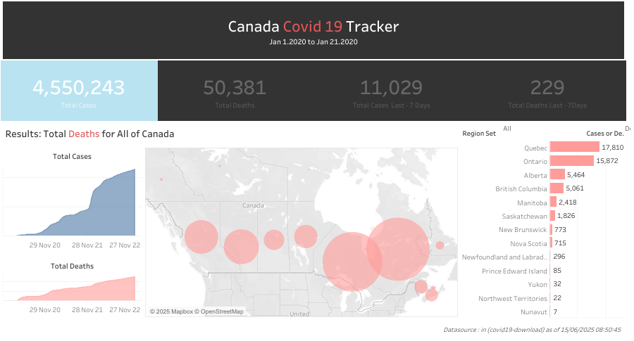

# Canada-Covid-19-Tracker
A Tableau Dashboard that visualizes COVID-19 trends across Canadian provinces using interactive graphs and maps.

## 🔧 Tools Used
- Tableau Public
- CSV/Excel
- GitHub

## 📁 Files Included
- `Canada_Covid19_Tracker.twbx` – Tableau workbook
- `canada_covid_data.csv` – Raw dataset
- `Covid_19_Canada.png` – Dashboard screenshot
- `README.md` – Project documentation

## 📈 Key Features
- Province-wise case distribution
- Trend analysis over time
- Filters for province and date

## 🖼 Preview

## 🔗 (Optional) Tableau Public Link
[View Dashboard on Tableau Public]([https://public.tableau.com/app/profile/yourname](https://public.tableau.com/app/profile/shravani.kathilkar/viz/project1_17500184607900/CovidTracker?publish=yes ))

## 🚀 How to Use
1. Download `.twbx` file
2. Open with Tableau
3. Interact with filters and explore
